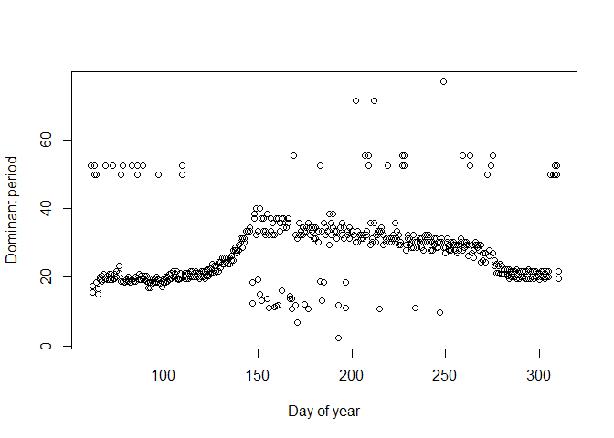

accel: R Functions to analyze accelerometer data
================================================

This package includes functions to read in and analyze accelerometer data generated by [Oregon Research Electronic AL100 Acceleration Loggers](https://sites.google.com/site/oregonresearchelectronics/home).

Installation
------------

``` r
#Install
devtools::install_github("agougher/accel")
```

Example data
------------

This example data includes the dominant period values for each of three dimensional axes (x, y, z), and weights reflective of the difference between the dominant and second-most dominant periods.

``` r
require(accel)
```

    ## Loading required package: accel

``` r
data(al3)
head(al3)
```

    ##   day    peakX    peakY    peakZ     wpeakX    wpeakY     wpeakZ
    ## 1  61 55.44444 52.52632 52.52632 0.20141298 0.1585592 0.13467467
    ## 2  62 52.52632 15.59375 17.50877 0.08484053 0.1573944 0.21712296
    ## 3  63 52.52632 52.52632 49.90000 0.16278577 0.1131661 0.04290269
    ## 4  64 19.19231 49.90000 18.48148 0.09507804 0.1368361 0.07151376
    ## 5  65 19.56863 15.12121 16.63333 0.27714685 0.4667288 0.40435821
    ## 6  66 19.56863 19.19231 19.96000 0.33783686 0.5037416 0.61549694

``` r
domY <- al3[,c("day","peakY","wpeakY")]
domZ <- al3[,c("day","peakZ","wpeakZ")]
colnames(domY) <- c("day","value","weights")
colnames(domZ) <- c("day","value","weights")

dat <- rbind(domY,domZ)

plot(dat$day, dat$value, xlab="Day of year",ylab="Dominant period")
```



Removing outliers
-----------------

This function identifies and removes points that have residuals beyond 1.5x the interquartile range of a loess curve. In the plot below, points in purple are kept after removing outliers.

``` r
dat2 <- rmOut(dat)
plot(dat$day, dat$value)
points(dat2$day, dat2$value, pch=20, col="purple", xlab="Day of year",ylab="Dominant period")
```


Fitting phenology model described by [Elmore et al. 2012](http://onlinelibrary.wiley.com/doi/10.1111/j.1365-2486.2011.02521.x/full)
-----------------------------------------------------------------------------------------------------------------------------------

The model is a dual logistic curve, with an additional parameter that controls the slope of the line between the two logistic curves. In the plot below, black points are cleaned dominant period values, and red points are fitted values from the model. The two vertical lines are the spring and autumn inflection points of the model.

``` r
#Remove NA's from data frame
dat2 <- na.omit(dat2)

#Set starting parameters
m <- c(20, 19, 145, 6, 275, 3, 1)

#Fit non-linear least squares model
mod = nls(value ~ a + (b- g*day)*((1/(1+exp((c-day)/d))) - (1/(1+exp((e-day)/f)))), 
             start = list(a = m[1],b = m[2],c = m[3], d = m[4], e = m[5], f = m[6], g = m[7] ), 
             algorithm="port",control = list(maxiter = 500), data=dat2, weights=dat2$weights^2)

#Plot data, and fitted values
plot(dat2$day, dat2$value, pch=20, xlab="Day of year",ylab="Dominant period")
points(dat2$day, fitted(mod), pch=20, col="red", lwd=4)
abline(v=c(coef(mod)[3],coef(mod)[5]))
```


